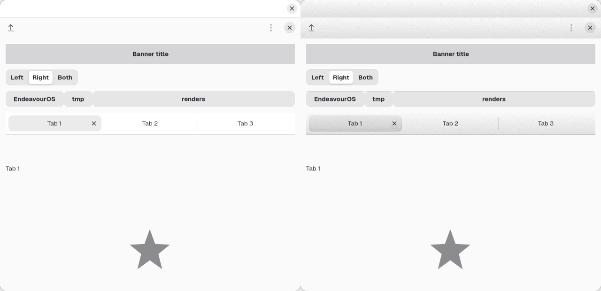
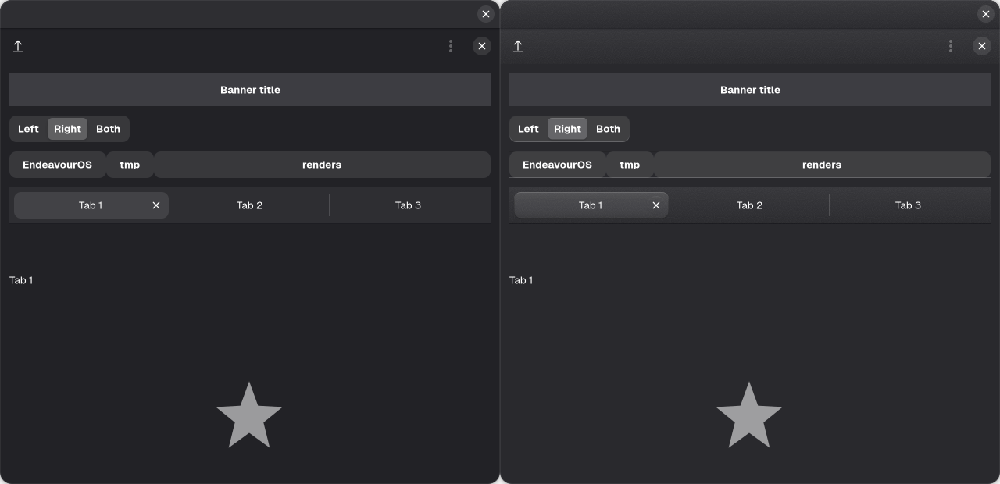

<!--
SPDX-FileCopyrightText: 2026 mauriciobc
SPDX-License-Identifier: LGPL-2.1-or-later
-->

# adwaita-overlay

Bevels, texture and depth for libadwaita. It is a CSS sheet loaded *above*
libadwaita's own stylesheet, not a fork: libadwaita is never patched,
replaced or rebuilt, and a selector-contract check fails loudly if an
upstream release stops providing something the sheet depends on.





Left: stock Adwaita. Right: with adwaita-overlay. (Light scheme above, dark
scheme below.)

## What it covers

- libadwaita apps (Nautilus, Settings, Text Editor, ...) and plain GTK4 apps,
  through the per-user sheet (see below).
- **Not** GTK3. The GTK3 front is a development tool and is not part of 1.0.
- The gnome-shell front is an empty stylesheet today.
- Flatpak apps only with an override:
  `flatpak override --user --filesystem=xdg-config/gtk-4.0`. Flatpak has no
  theme extension point for GTK4.

## Install

- **Arch:** package `adwaita-overlay` (once published on the AUR).
- **From source** (needs `meson` and `sassc`):

  ```
  meson setup _build --prefix=/usr
  meson compile -C _build
  meson test -C _build
  sudo meson install -C _build
  ```

## Enable, update, remove

```
adwaita-overlay-install              # enable for your user
adwaita-overlay-install --update     # after a package upgrade
adwaita-overlay-install --uninstall  # remove
```

It copies the sheet to `~/.config/gtk-4.0/adwaita-overlay.css` and adds one
marked `@import` line to your `gtk.css`; `--uninstall` removes exactly that
line and restores your file byte for byte. Running apps need a restart.

Do not select the theme through `gtk-theme`: libadwaita ignores it, and
reports of selecting a theme globally breaking libadwaita layout are recorded
in `meson.build`.

## Upgrade safety

`adwaita-overlay`'s contracts list every libadwaita selector and variable the
sheet depends on. `check-selectors` compares them with the installed
libadwaita, and the Arch package runs it from a pacman hook after every
libadwaita upgrade (it reports, it never blocks the transaction).

## Hacking, packaging, contributing

- [docs/HACKING.md](docs/HACKING.md): layout, tools, design notes
- [docs/PACKAGING.md](docs/PACKAGING.md): building packages for other distros
- [CONTRIBUTING.md](CONTRIBUTING.md)

## License

LGPL-2.1-or-later. See [LICENSE](LICENSE).
